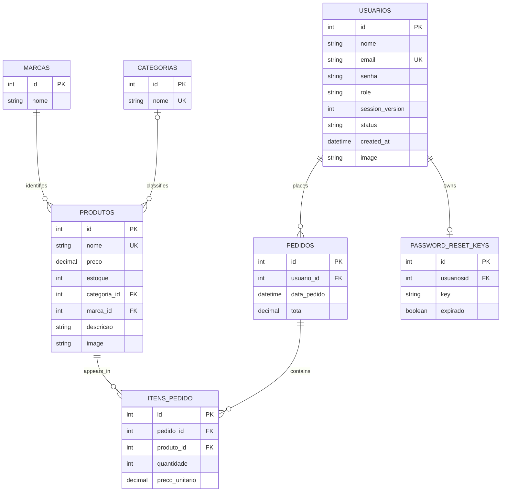

# MyShop

MyShop is an e-commerce MVP built as a single Next.js application: the pages and API are part of the same project and share the repository structure. Currently, the backend/API is more complete; the shopping interface is still under development.

## Application and Current State

### Implemented Backend/API

- User registration and login, with JWT stored in an `HttpOnly` cookie.
- Authentication cookies configured with `Secure`, `SameSite=Strict`, `/api/v1` scope, and expiration.
- Session validation using `session_version` and role-based authorization (`role`).
- Password reset requests and password resets.
- User management by administrators and self-account management.
- Management operations for products, brands, and categories, with role-based authorization.
- Product search by name, description, brand, and category, along with pagination.
- Product and account image uploads using Cloudinary.
- Order creation, retrieval, and deletion with associated items.
- Rate limiting with Upstash Redis, validation with Zod, centralized error handling, and API/database health checks.

The API sends the JWT through an `HttpOnly` cookie; this is the primary authentication mechanism, rather than a Bearer Token in the `Authorization` header.

### Shopping Interface Still Under Development

The repository already contains Next.js pages, but they do not yet form the complete e-commerce interface. The intended customer flow includes registration and login, password recovery, paginated catalog browsing and search, account management, cart management, and order checkout. This flow is the goal of the frontend.

The cart will be stored in `localStorage` in the MVP, without database persistence. When the customer completes checkout, the API will create the order and its items. The happy path ends with order creation: this version does not include a payment gateway or payment/order status lifecycle.

## Stack

- Node.js 24.x, Next.js 16, and React 19.
- PostgreSQL 16, `pg`, and `node-pg-migrate`.
- JWT, bcrypt, and Zod.
- Upstash Redis for rate limiting.
- Cloudinary for image storage.
- Nodemailer for email delivery.
- Jest for automated testing.

## Data Model

The diagram below summarizes the relational entities and their relationships according to the PostgreSQL migrations:



Each order belongs to a user and can contain multiple items. Each item references a product and stores its quantity and unit price. A product may have a category (the relationship allows `NULL`) and must reference a brand. The `password_reset_keys` table allows at most one record per user.

## Requirements

- Node.js 24.x and npm.
- Docker with Docker Compose.
- Upstash Redis credentials.

## Local Setup and Execution

1. Install the dependencies:

   ```bash
   npm install
   ```

2. Create a `.env` file in the project root with the required variables. For the local PostgreSQL instance started by Docker Compose, configure `DB_PORT=5432`.

3. Start the environment:

   ```bash
   npm run dev
   ```

The script starts PostgreSQL through Docker Compose, waits for the database, applies the migrations, and starts Next.js in development mode. The server will be available at `http://localhost:3000`.

## Environment Variables

Required for the local environment:

| Variable                   | Usage                                                                    |
| -------------------------- | ------------------------------------------------------------------------ |
| `POSTGRES_USER`            | PostgreSQL and container user.                                           |
| `POSTGRES_PASSWORD`        | PostgreSQL and container password.                                       |
| `POSTGRES_DB`              | Database name.                                                           |
| `DB_PORT`                  | Local database port; use `5432` with the project's Docker Compose setup. |
| `JWT_SECRET`               | Secret used to sign and validate JWTs.                                   |
| `UPSTASH_REDIS_REST_URL`   | REST URL for the Redis instance used by rate limiting.                   |
| `UPSTASH_REDIS_REST_TOKEN` | Access token for Upstash Redis.                                          |

Additional variables, depending on the features being used:

| Variable                | Usage                                                                                     |
| ----------------------- | ----------------------------------------------------------------------------------------- |
| `POSTGRES_HOST`         | Database host in production; locally, the application uses `localhost`.                   |
| `EMAIL_USE`             | Account used by Nodemailer with Gmail SMTP.                                               |
| `EMAIL_PASS`            | App password for the email account. Email sending is skipped in `development` and `test`. |
| `FRONTEND_URL`          | Base URL used for password-reset links sent by email.                                     |
| `CLOUDINARY_CLOUD_NAME` | Cloudinary account name.                                                                  |
| `CLOUDINARY_API_KEY`    | Cloudinary API key.                                                                       |
| `CLOUDINARY_API_SECRET` | Cloudinary API secret.                                                                    |

## Tests

The test suite currently contains **237 automated tests**, organized into 13 test suites.

Run the automated test suite with:

```bash
npm test
```

The command starts PostgreSQL, waits for the connection, applies the migrations, and runs Jest together with the Next.js server in test mode.

To run the tests in watch mode:

```bash
npm run test:watch
```

## Project Structure

```text
infra/       Database, Docker Compose, migrations, Cloudinary, and scripts

models/      Database queries and data persistence

pages/       API routes under api/v1 and existing Next.js page files

schemas/     Schemas and validation variables

services/    Business logic for authentication, catalog, orders, and files

styles/      Global styles and existing CSS Modules

test/        Jest tests and test helpers

utils/       Authentication, errors, email, files, and validation

public/      Public assets
```
